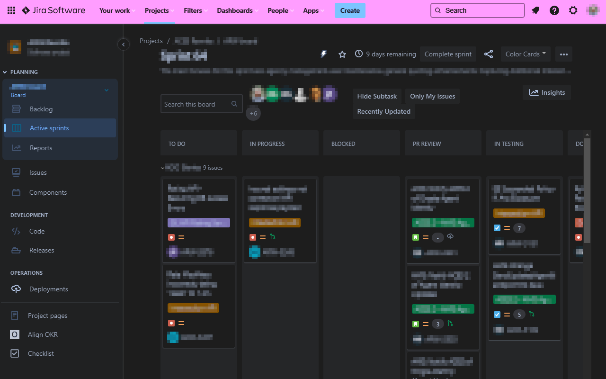
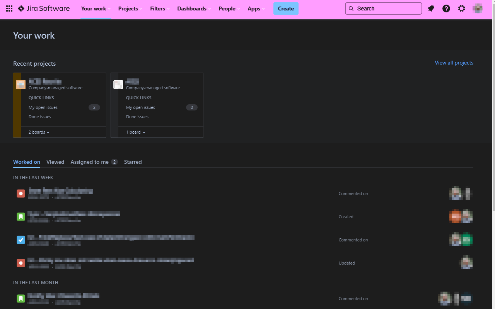
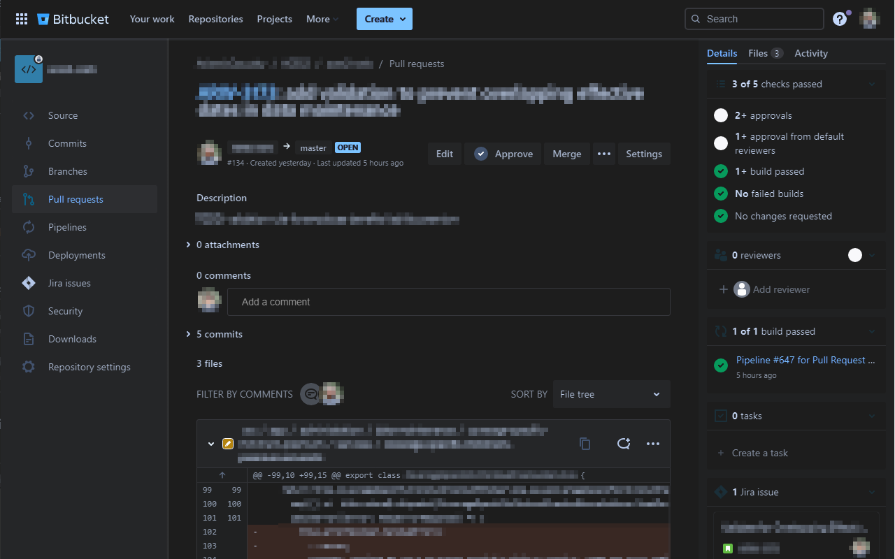
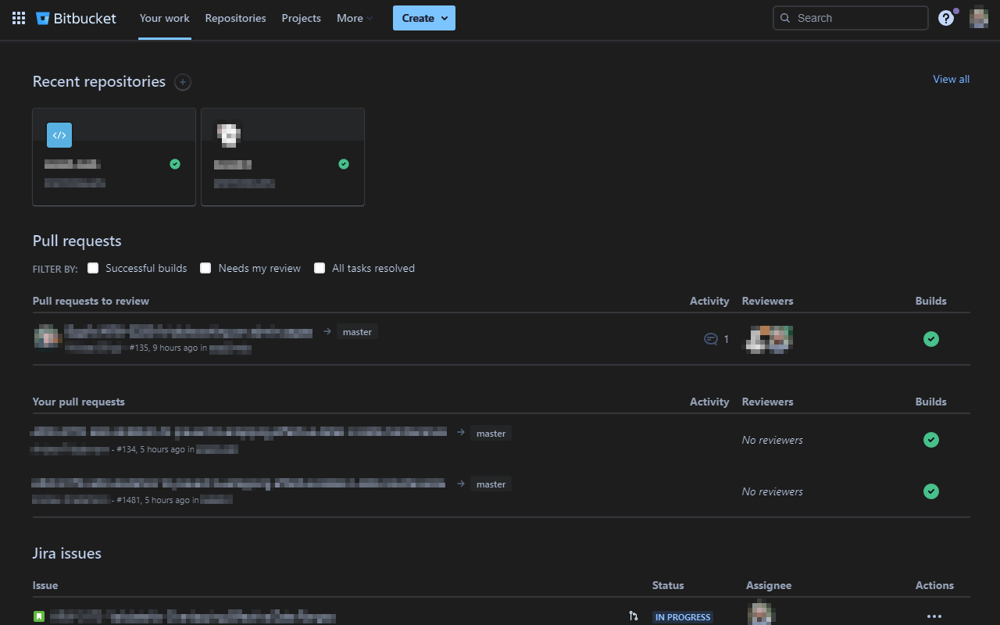

Atlassian - Dark Mode
===========================
Dark Theme for Jira & Bitbucket cloud.

Installation
------------
- git clone
- Open `chrome://extensions/`.
- Enable `Developer mode`.
- Click `Load unpacked extension...`.
- Select the folder of this repository.

Screenshots
------------

